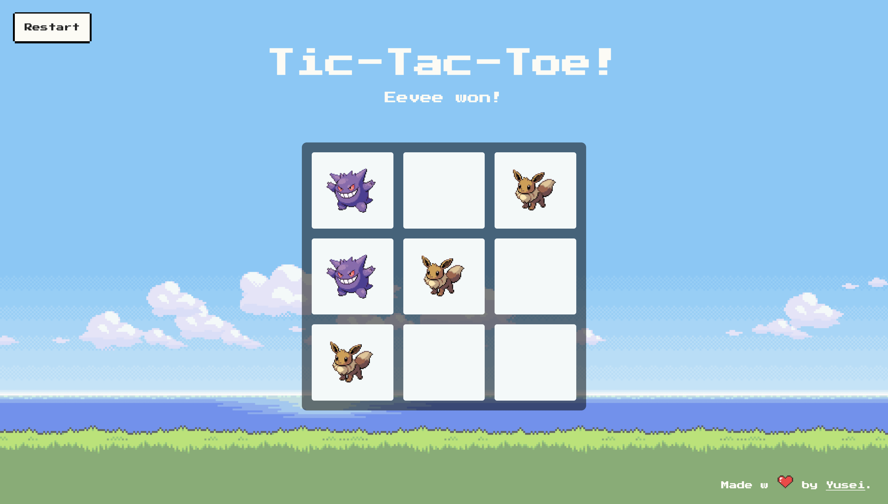

# Tic-Tac-Toe
[Live Demo](https://yusei07.github.io/tic-tac-toe/)

A pixelated tic-tac-toe game with pokemons. In this project, I've learned to utilize objects, also design patterns like factory and module.
